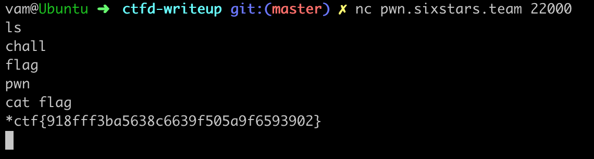

##### 题目是这样子的：

```bash
$ nc pwn.sixstars.team 22000
```

##### nc(netcat or ncat) 是一个linux下的网络工具

常见用法：

* nc -l 8080: 监听8080端口
* nc -l -u 1234: 默认监听tcp端口，-u可以监听UDP端口
* nc 192.168.1.100 80: 与192.168.1.100下的80端口的server连接
* 传文件B->A：
    - A: nc -l 8080 > file.txt
    - B: nc 192.168.1.100 8080 --send-only < data.txt
* ncat -l 10000 -e /bin/bash: 开后门

##### 把命令复制到终端运行, 程序没有反应，运行ls,发现下方显示了几个文件

说明，这道题是连接到了服务端一个shell上，其中当前目录下有flag文件， 运行cat flag:

顺利地拿到了flag